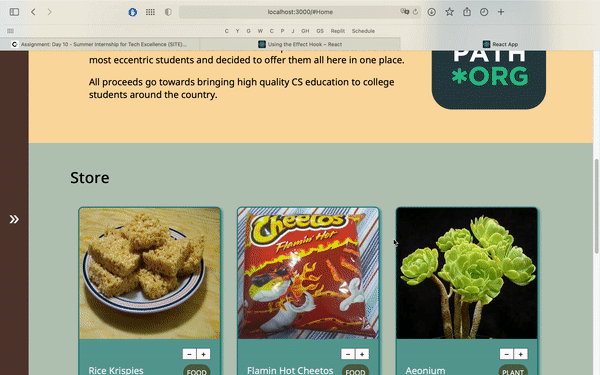

## Week 2 Assignment: Student Store

Submitted by: **Ann Wang**

Deployed Application (optional): [Student Store Deployed Site](ADD_LINK_HERE)

### Application Features

#### CORE FEATURES

- [x] The API should contain an endpoint that serves an array of all products in the store
- [x] A Store model should handle all data management logic for the API and be the interface for read/write operations to the JSON file.
- [x] The frontend should include a landing page that displays the products available for purchase.
- [x] Each product should have an individual page that shows the details of the product.

#### STRETCH FEATURES

- [ ] Deploy your website with Heroku & Surge. 
- [x] An endpoint should exist for creating orders and saving them to a JSON file. Each order should contain the email of the person placing the order, the items associated with the order, and the quantity of each item purchased.
- [-] There should be a `Sidebar` component that appears on every page and has two states - `open` and `closed`. When the sidebar is opened, it should display a shopping cart of all the products the user currently has in their cart. It should also calculate and display the total amount in dollars for the checked-out items. When it's closed, the sidebar should be much thinner and not display its internal content.
- [ ] A checkout form should be available that allows the user to enter their email and send their order to the API.
- [x] Create an endpoint for fetching all orders in the database, and an endpoint for serving an individual order based on its id.
- [x] Create an endpoint that serves only a single product based on the product's id
- [ ] Build a page in the UI that displays the list of all past orders and lets the user click on any individual order to take them to a more detailed page of the transaction.
- [ ] Allow users to use an input to filter orders by the email of the person who placed the order.

### Walkthrough Video

User Interface Walkthrough

Create Order / Create Product

Get store / Get Product / Post Errors

### Reflection

* Did the topics discussed in your labs prepare you to complete the assignment? Be specific, which features in your weekly assignment did you feel unprepared to complete?

The bank of codepath lab had a lot of useful functions that I referenced to for the backend functions, especially the recordTransaction was very informative on how to write directly into the json file. The routes portion of lab the twitter lab was also very helpful when I was working on the assignment and linking products to their own pages. I felt unprepared to complete the shopping cart sidebar because I was unsure how to link new changes to cart to sidebar.

* If you had more time, what would you have done differently? Would you have added additional features? Changed the way your project responded to a particular event, etc.
  
I would have planned out my ui before attempting to style since I spent a lot of time trying to get certain sections to look how I wanted but I did not have a clear idea of what I wanted it to look like. I would want to add more products and a page to separate products by category, as well as a search form. Furthermore, I would want to make a functional shopping cart.

* Reflect on your project demo, what went well? Were there things that maybe didn't go as planned? Did you notice something that your peer did that you would like to try next time?

I was able to present what I had worked on and talked about any challenges I had faced. I noticed that someone had implemented a search bar so that is what I would like to try.

### Open-source libraries used

- Add any links to open-source libraries used in your project.

### Shout out

Shout out to Raahima and Tirumari for helping me debug my individual product page! 